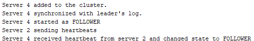
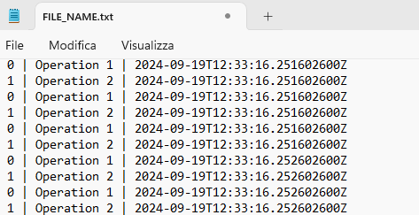
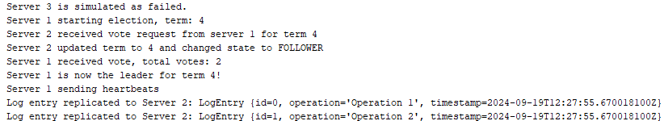
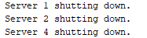

# RAFT Full-Features

This RAFT implementation builds upon the core RAFT algorithm by incorporating three key features designed to simulate more realistic distributed system behavior:

1. **Dynamic Cluster Reconfiguration**
The code supports dynamic addition and removal of servers from the cluster. This functionality allows the cluster to scale by adding new servers or decommissioning existing ones:

_AddServer and RemoveServer_ methods: These allow the administrator to introduce new servers to the cluster. The new servers automatically synchronize their logs with the leader to ensure consistency. When a server is removed, its scheduled tasks and heartbeats are cancelled, and it is removed from the active list.
_Log synchronization_: When a new server joins, it copies the leader’s log, ensuring it is in sync with the cluster's current state.  

2. **Persistent Log Storage**:
Logs are not only stored in memory but are also saved persistently using the file system, allowing the system to recover from failures:

_LogStorage_ class: This class handles the persistent storage of log entries. It uses the file system to save and load logs (saveLogs and loadLogs methods), ensuring that a server can retrieve its log history after a failure.
_File-based recovery_: Logs are saved in a text file, and when a server restarts, it loads the logs from the file into memory, ensuring no data is lost due to crashes or restarts.  

3. **Fault Simulation**:
The system allows the simulation of server failures and recovers from them gracefully:

_SimulateFailure_ method: This feature simulates the failure of any server. The server stops sending heartbeats and becomes inactive, allowing other servers to detect its failure and trigger a new election.
_Leader election_: When a leader fails, other servers can detect the absence of heartbeats and automatically initiate a new election. This illustrates RAFT’s fault-tolerant capabilities, ensuring that the system continues to function even when some servers go offline.

**Testing Highlights: Dynamic Cluster Reconfiguration**
 

  

This log represents the Dynamic Cluster Reconfiguration process in action, specifically the addition of a new server (Server 4) to an already running RAFT cluster. Here's a step-by-step breakdown of what each line means:

- _Server 4 added to the cluster_ : This log entry indicates that a new server, Server 4, has been introduced into the cluster. This is handled by the addServer method, which adds Server 4 to the list of active servers.

- _Server 4 synchronized with leader's log._ : After being added, Server 4 synchronizes its log with the leader's existing log. This ensures that Server 4 is up-to-date with all previous operations performed in the cluster before it joined. This is a critical part of maintaining consistency in the RAFT algorithm and is done by copying the leader's log to the new server.

- _Server 4 started as FOLLOWER_ : Once synchronized, Server 4 begins its operation in the FOLLOWER state, which is the default state for all servers when they join a RAFT cluster. As a follower, it will listen for heartbeats from the leader to maintain its state and avoid triggering an election.

- _Server 2 sending heartbeats_ : This indicates that Server 2 is currently the leader of the cluster and is sending out periodic heartbeats to all other servers, including the newly added Server 4. The heartbeats are used to confirm leadership and prevent other servers from starting an election.

- _Server 4 received heartbeat from server 2 and changed state to FOLLOWER_ : Upon receiving a heartbeat from Server 2, Server 4 confirms that Server 2 is the valid leader and remains in the FOLLOWER state. The heartbeat also ensures that Server 4 doesn't start a new election, since it knows the cluster is functioning correctly with a leader in place.  

**Testing Highlights: Persistent Log Storage**
 

  

This screenshot displays the log entries stored in a txt file. Each log entry includes an ID, operation description, and timestamp. The entries represent the persistent log data captured during the RAFT simulation, illustrating how log entries are recorded and preserved for consistency and recovery. The repeated entries show multiple instances of log operations performed by the RAFT system.

**Testing Highlights: Simulation failed**
 

  

- _Server 3 is simulated as failed._ : This indicates that Server 3 has been simulated to fail, likely for the purpose of testing the RAFT algorithm's fault-tolerance capabilities. It means Server 3 is no longer participating in the cluster for now.
- _Server starting election, term: 4_ : Due to the failure of Server 3, a server (likely Server 1 based on later logs) has detected that the cluster needs a new leader, so it starts an election for term 4.
- _Server 2 received vote request from server 1 for term 4_ : Server 1 has requested votes from other servers to become the new leader. Server 2 receives this request for term 4.
- _Server 2 updated term to 4 and changed state to FOLLOWER_ : Server 2 recognizes that this is a valid election for term 4, so it updates its term and transitions to the FOLLOWER state, since it’s no longer a candidate or leader.
- _Server 1 received vote, total votes: 3_ : Server 1 successfully receives votes (from servers like Server 2) and collects enough votes to proceed with the election.
- _Server 1 is now the leader for term 4!_ : With a majority of votes, Server 1 is elected as the new leader for term 4. This log confirms the completion of the election process.
- _Server 1 sending heartbeats_ : As the new leader, Server 1 begins sending heartbeats to the other servers, confirming its leadership and ensuring no other elections are triggered.
- _Log entry replicated to Server 2: LogEntry {id=0, operation='Operation 1', timestamp=2024-09-19T12:33:16.247602600Z}_ : The leader (Server 1) starts replicating log entries to Server 2. This log shows that an entry with ID=0 was successfully replicated.

 

  

- _Server 1 shutting down._ : This indicates that Server 1, which was recently elected as the leader, is shutting down. This can be part of another fault simulation or an intentional test.
- _Server 2 shutting down. : Server 2, which had just synchronized logs with Server 1, is also shutting down. This would further disrupt the cluster.
- _Server 4 shutting down._ : Finally, Server 4 is shutting down. With Server 1, 2, and 4 down, only Server 3 (if it comes back online) and possibly other servers in the cluster are left active, which would likely lead to another election to restore leadership.

All the code in this repository is commented to provide additional information and context. If you need any details or explanations, please refer to the comments within the code.
